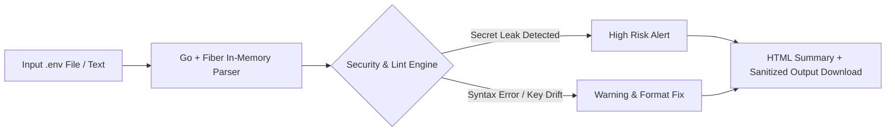

# EnvGuard — Zero-Dependency .env Security & Consistency Auditor

> A lightweight, lightning-fast developer utility to analyze, sanitize, format, and audit environment configuration files (`.env`) for secrets leakage, syntax errors, and multi-environment drift.

[](#) [](#) [](#)

---

## 1. Product Overview

**EnvGuard** is a single-purpose developer security and consistency utility. It takes `.env` files (or comparisons between `.env.example`, `.env.staging`, and `.env.production`) as input, inspects them in-memory without saving sensitive credentials to disk or remote servers, and produces an instant compliance and security report.

* **Target Audience:** DevOps Engineers, Backend Developers, Tech Leads, QA Automation Engineers.
* **Core Philosophy:** *One input (`.env`) → Fast local analysis → Clean report + Sanitized output.*

---

## 2. Problem Statement

Developers frequently leak plain-text API keys, secret tokens, or private RSA keys into version control because of malformed `.env` files or missing `.gitignore` rules. Furthermore, microservices often crash in production due to missing or mismatched environment variable keys across `staging` and `production` environments.

```text
PAINFUL WORKFLOW:
Deploy App → App Crashes → Check Server Logs → Realize DATABASE_URL is missing in .env → Fix manually → Redeploy

OPTIMIZED WORKFLOW:
.env / .env.example
  ↓
EnvGuard (Local Processing)
  ↓
Instant Missing Key Alert + Secret Leak Prevention Report
```

---

## 3. Core Value Proposition

* **Prevents Secret Leaks:** Detects high-entropy keys, AWS secret tokens, JWT secrets, and private keys accidentally placed in public repositories.
* **Eliminates Environment Drift:** Compares `.env.production` against `.env.example` in under 10 milliseconds to flag missing or mismatched keys.
* **100% Private & Local:** All analysis is performed entirely in memory. Zero external server calls; zero database persistence.

---

## 4. Target Users

| User | Primary Use Case | Value Delivered |
| :--- | :--- | :--- |
| **Backend Developer** | Validating local `.env` before git commits | Zero accidental API key commits |
| **DevOps / CI Engineer** | Integrating lint checks into pre-commit hooks | Fails build early if required keys are missing |
| **Tech Lead / Auditor** | Standardizing `.env.example` templates | Keeps team configurations cleanly documented |

---

## 5. Product Workflow



---

## 6. MVP Scope

### Included in MVP
* Single and multi-file drag-and-drop upload (`.env`, `.env.example`, `.env.local`).
* Secret Entropy & Regex Scanner (Detects AWS, Stripe, GitHub, OpenAI keys, RSA private keys).
* Key Comparison Matrix (Shows missing variables across multiple environments).
* Instant Sanitizer (Generates a clean `.env.example` with masked secrets automatically).
* Simple HTML/CSS/JS presentation UI (No build setup required).

### Explicitly Excluded (Non-Goals)
* No persistent database storage or user accounts.
* No remote secrets vault integration (HashiCorp Vault, AWS Secrets Manager).
* No auto-deployment or remote server SSH modification.

---

## 7. Product Evaluation Scorecard

| Criterion | Score | Justification |
| :--- | :---: | :--- |
| **Problem Pain** | 9/10 | Accidental secret leakage causes high security risks and crashes. |
| **Problem Frequency** | 8/10 | Occurs daily in multi-developer software teams. |
| **Customer Clarity** | 9/10 | Clearly defined target: Software Developers and DevOps Engineers. |
| **MVP Simplicity** | 10/10 | In-memory parser without complex workflows. |
| **Monetization Potential** | 6/10 | Ideal as a one-time Developer Desktop Tool or CLI binary. |
| **Technical Feasibility** | 10/10 | High feasibility using Go's fast string parsing capabilities. |
| **Product Independence** | 10/10 | Independent standalone utility. |
| **Competitive Opportunity**| 8/10 | Existing tools are either bloated CLI-only tools or unsafe web app converters. |
| **TOTAL SCORE** | **74 / 80** | **APPROVED HIGH-VALUE MICRO PRODUCT** |

---

## 8. Technology Stack & Justification

| Layer | Technology Selected | Reason for Selection |
| :--- | :--- | :--- |
| **Backend** | **Go + Fiber** | Ultra-lightweight binary, near-instant CPU execution, zero memory footprint. |
| **Database** | **None (No DB)** | Zero storage required; processing is completely stateless and in-memory. |
| **Frontend** | **HTML + CSS + JavaScript** | Simple, fast-loading, framework-free UI to ensure instant execution. |
| **Deployment** | **Single Executable Binary / Docker** | Easy standalone distribution for local or self-hosted CLI/Web use. |

---

## 9. Proposed Future Repository Structure

```text
env-guard/
├── backend/
│   ├── main.go
│   ├── parser/
│   ├── scanner/
│   └── handlers/
├── frontend/
│   ├── index.html
│   ├── styles.css
│   └── app.js
├── architecture/
│   └── ARCHITECTURE.md
├── agents/
│   ├── architect.md
│   └── developer.md
└── README.md
```

---

## 10. AI Agent Team Roles

* [architect.md](file:///home/ahmet/Desktop/Projects/micro-products/env-guard/agents/architect.md): Defines parsing rules, entropy scoring logic, and memory safety boundaries.
* [developer.md](file:///home/ahmet/Desktop/Projects/micro-products/env-guard/agents/developer.md): Implements the Go Fiber endpoints, regex engines, and lightweight UI components.
